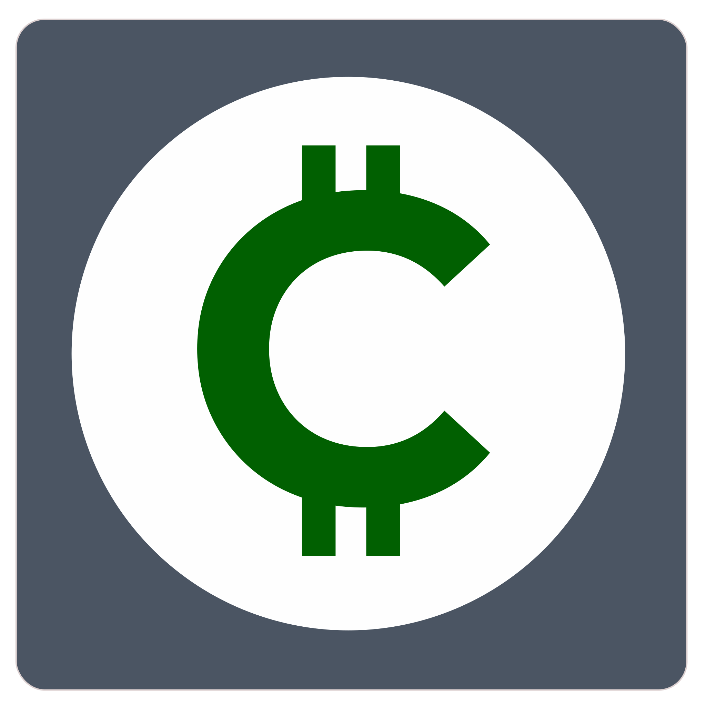
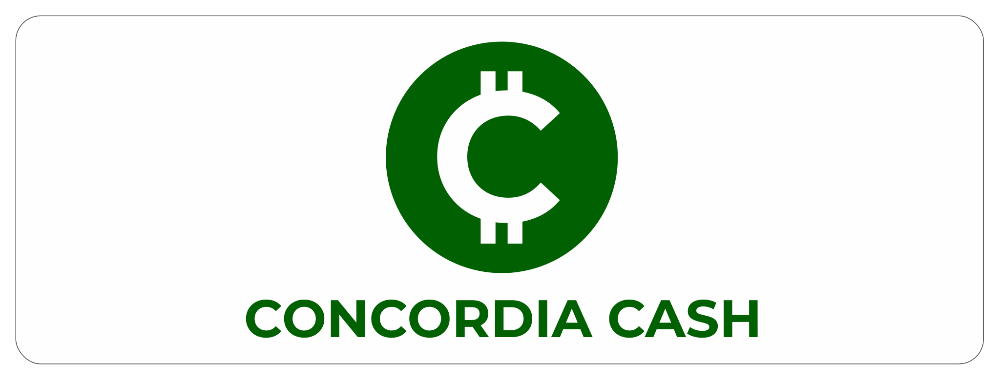
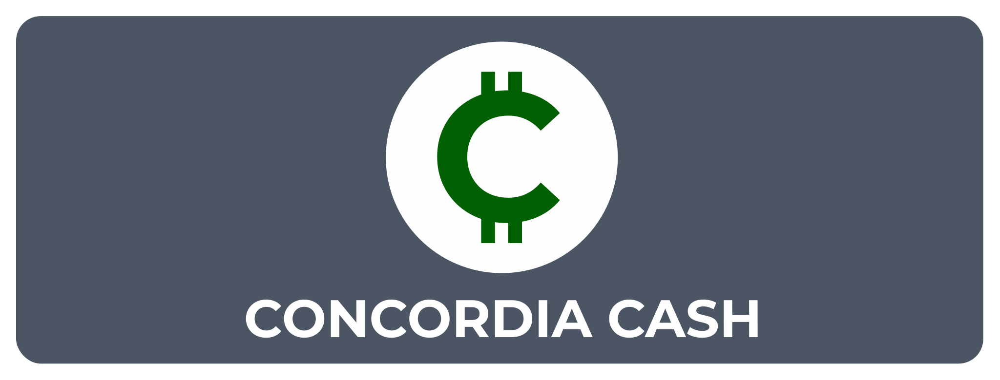
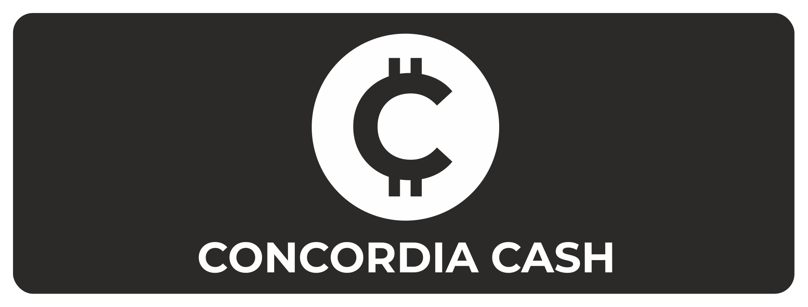
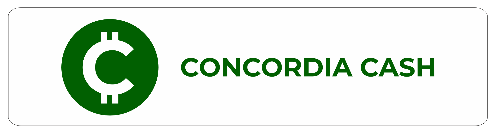
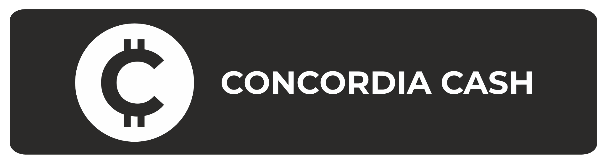
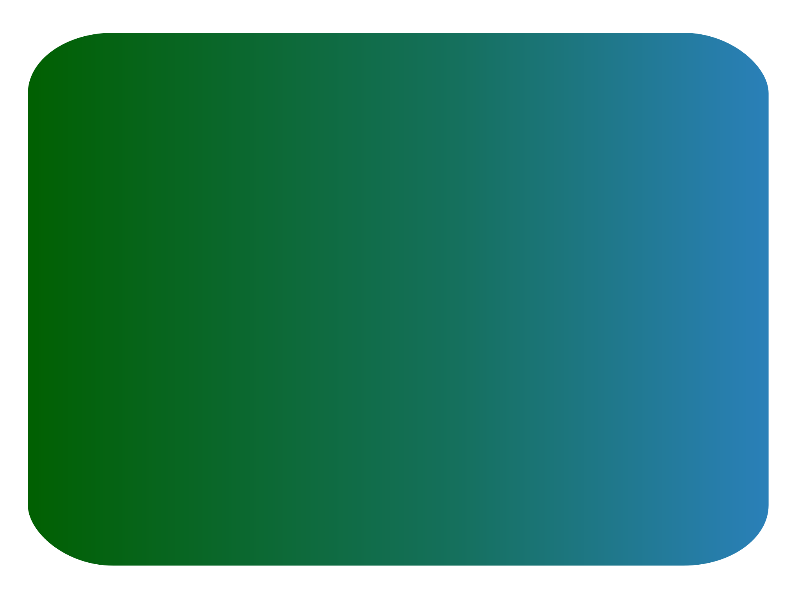

# CONCORDIA CASH 
### Brand Guidelines

Welcome to the official brand guidelines for CONCORDIA CASH. 

This document is your comprehensive guide to understanding and correctly applying our brand identity, reflecting our bold and revolutionary mission in the blockchain landscape.

Born from the merge of 17 abandoned blockchains, CONCORDIA is not just a new platform, it's a new philosophy of decentralized governance. 

Consistent use of these guidelines will ensure that **CONCORDIA CASH** is always presented clearly and powerfully, reinforcing our vision to unify and revitalize forgotten projects, and empower users through complete transparency and participation. 

These guidelines are intended for all members, partners, developers, and anyone creating communications for or about **CONCORDIA CAS**H.

## 1. Logo Guidelines

The **CONCORDIA CASH** logo is the most recognizable element of our brand. 

This section outlines its correct usage, variations, and restrictions. Consistent application of the logo is essential for maintaining brand recognition and integrity across all platforms and materials. It visually embodies our commitment to precision, reliability, and innovation.

### 1.1 Primary Logo

The primary logo features a stylized 'C' within a green circle. The 'C' is inspired by the Montserrat Bold typeface, reflecting strength and modernity. 

The circular enclosure symbolizes unity, the decentralized nature of our DAO, and the collective power derived from our community. 

It represents the unification of diverse projects into a cohesive, secure ecosystem.

### 1.2 Logo Variations

To ensure versatility across platforms and applications, the following logo variations are officially approved. 

Each variation maintains brand integrity while allowing flexibility for different backgrounds, use cases, and design requirements.

| Variation | Description | Example |
|-----------|-------------|---------|
| Icon / Favicon | For all kind of applications |  |
| Monochrome Reverse | For dark backgrounds |  |
| Black & White Negative | For specific applications |  |

### 1.3 Combined Logo and Logotype

The logo can be combined with the "**CONCORDIA CASH**" logotype to form the complete brand mark. 

This lockup ensures consistent presentation of the full brand name alongside the iconic symbol, reinforcing brand recognition and professionalism across all applications.

#### Vertical Layouts
| Variation | Description | Example |
|-----------|-------------|---------|
| Vertical (Full Color) | Combined Logo & Text |  |
| Vertical (Monochrome Reverse) | Combined Logo & Text |  |
| Vertical (Black and White) | Combined Logo & Text |  |

#### Horizontal Layouts
| Variation | Description | Example |
|-----------|-------------|---------|
| Horizontal (Full Color) | Combined Logo & Text |  |
| Horizontal (Monochrome Reverse) | Combined Logo & Text |  |
| Horizontal (Black and White) | Combined Logo & Text |  |

### 1.4 Minimum Size & Clear Space

To maintain legibility and visual impact, please adhere to the following guidelines: 
- **Clear Space:** A protective clear space must surround the logo at all times, free from text, graphics, or any distracting elements. This space should be proportionate to the size of the logo itself to preserve its integrity and visibility.
- **Minimum Size:**  The logo must never be used below the specified minimum dimensions. Using it at a smaller scale can compromise legibility and negatively impact brand perception.

    | Application | Minimum Width/Height |
    |-------------|----------------------|
    | Digital (Web, Apps) | 32 pixels |
    | Print (Small items) | 1 cm / 0.4 inches |
    | Favicon / App Icon | 16 pixels (full logo) |
    | Black and White (Negative) | 32 pixels |

### 1.5 Incorrect Usage

To maintain brand integrity, the **CONCORDIA CASH** logo must not be altered in any way. The following are examples of misuse that are strictly prohibited.

Adhering to these restrictions ensures the logo is always presented as intended, reinforcing a consistent, recognizable, and professional brand image across all platforms and materials.

| DO NOT | Description |
|--------------|-------------|
| Stretch or Distort | Do not alter the logo’s aspect ratio under any circumstances. |
| Use unauthorized colors | Only approved brand colors should be used |
| Add Effects (Shadows, etc.) | Avoid applying shadows, glows, or other stylized effects such as 3D rendering |
| Place on Busy Backgrounds | Ensure sufficient contrast and maintain clear space around the logo
| Rotate | Keep the logo upright at all times. It must never be rotated or tilted |
| Outline | Do not add outlines, strokes, or borders that are not part of the original design

## 2. Color Palette

The **CONCORDIA CASH** color palette is integral to our brand identity. It evokes trust, innovation, and financial stability. 

This section details our primary, secondary, and accent colors, along with their specific codes for digital and print applications. Consistent use of these colors is key to a unified brand presence.

### 2.1 Primary Brand Colors

These colors form the foundation of the **CONCORDIA CASH** brand identity and are derived directly from the logo. As cornerstone colors, they should be used most prominently across all brand materials.

| Color Name | HEX | RGB | Usage | Color |
|-------|-----|-----|-------|-------|
| Concordia Green | `#016001` | 1, 96, 1 | Primary branding, logo, calls-to-action |  |
| Concordia White | `#FEFEFE` | 254, 254, 254 | Backgrounds, text on dark backgrounds |  |

### 2.2 Secondary & Accent Colors

These colors complement the primary palette and should be used to enhance design elements such as UI components, illustrations, icons, or data visualizations.

Use them thoughtfully to reinforce brand harmony while ensuring Concordia Green and White remain dominant in all applications

| Color Name | HEX | RGB | Usage | Color |
|-------|-----|-----|-------|-------|
| Tech Blue | `#2A80B9` | 42, 128, 185 | Secondary actions, tech graphics |  |
| Dark Neutral Grey | `#4B5563` | 75, 85, 99 | Body text, secondary information |  |
| Light Neutral Grey | `#D1D5DB` | 209, 213, 219 | Borders, dividers |  |
| Accent Gold | `#FFD700` | 255, 215, 0 | Highlights, premium features |  |

### 2.3 Color Usage & Accessibility

- Strive for high contrast between text and background colors to meet WCAG AA accessibility standards. For example, Concordia White `#FEFEFE` text on Concordia Green `#016001` provides excellent contrast.
- Use Concordia Green as the primary call-to-action color across digital interfaces.
- Secondary colors should support, not overpower, the primary palette, ensuring brand hierarchy remains clear.
- Always test color combinations for legibility, especially considering users with color vision deficiencies.

### 2.4 Gradient Colors

Gradients can add depth and a modern aesthetic when used thoughtfully. Approved gradients are derived from our core brand colors to ensure visual consistency and alignment with our identity.

They are primarily recommended for backgrounds, large graphical elements, or subtle UI accentsm, always supporting the brand’s visual hierarchy without overshadowing key messaging or elements.

| Color Name | HEX | Usage | Color
|-------|-----|-------|-------|
| Concordia Green Gradient (Darker) | `linear-gradient (to right, #016001, #004000)` | Primary backgrounds, hero sections, large graphical elements. |  |
| Concordia Green to Tech Blue Gradient | `linear-gradient (to right, #016001, #2A80B9)` | Dynamic UI elements, data visualization backgrounds, subtle transitions. |  |
| Light Neutral Gradient | `linear-gradient (to bottom, #FEFEFE, #D1D5DB)` | Subtle background textures, card elements, containers. |  |

Always ensure text placed on gradients has sufficient contrast and readability. 

Avoid using gradients for small text or intricate details.

## 3. Typography

Typography plays a crucial role in communicating the personality and values of **CONCORDIA CASH**. This section defines the official fonts, their recommended usage, and typographic hierarchy.

Consistent typography ensures readability and a cohesive visual language that aligns with our modern, trustworthy identity.

### 3.1 Primary Font: Montserrat

Montserrat is our primary font. Its geometric forms and clean lines reflect modernity and stability, aligning with the 'C' in our logo (which was inspired by Montserrat Bold). It is highly versatile and should be used for headlines, subheadings, and prominent text elements.

Available via https://fonts.google.com/specimen/Montserrat

**Key Weights:**
- **Montserrat Black (900)** - For major headlines.
- **Montserrat Bold (700)** - For H2, H3, key calls-to-action.
- Montserrat SemiBold (600) - For H4, emphasis.
- Montserrat Medium (500) - For navigation elements and certain UI components.
- Montserrat Regular (400) - For short descriptive text where Montserrat is preferred over body copy.

### 3.2 Secondary Font: Open Sans

For body copy and longer text passages, Open Sans serves as our recommended secondary font. This highly legible humanist sans-serif complements Montserrat beautifully, offering excellent readability both on screen and in print.

Available via https://fonts.google.com/specimen/Open+Sans

**Key Weights:**
- **Open Sans Bold (700)** - For emphasis within body copy.
- Open Sans Regular (400) - For all main body text.
- Open Sans Light (300) - For captions or tertiary information.

### 3.3 Typographic Hierarchy

A clear typographic hierarchy enhances readability and guides the reader through content effectively. Follow this typographic scale for optimal consistency:

### Typography Hierarchy

| Type Element           | Font Family               | Weight        | Size (Desktop / Mobile)   | Line Height | Color     |
|------------------------|---------------------------|---------------|---------------------------|-------------|-----------|
| H1 / Page Title        | Montserrat                | Black (900)   | 2.5rem (40px) / 2rem (32px) | 1.2         | `#016001` |
| H2 / Section Title     | Montserrat                | Bold (700)    | 2rem (32px) / 1.75rem (28px) | 1.3         | `#016001` |
| H3 / Subsection Title  | Montserrat                | SemiBold (600)| 1.5rem (24px) / 1.25rem (20px) | 1.4         | `#016001` |
| H4 / Sub-subsection    | Montserrat                | SemiBold (600)| 1.25rem (20px) / 1.125rem (18px) | 1.5         | `#1f2937` |
| Body / Paragraph       | Open Sans                 | Regular (400) | 1rem (16px) / 0.9375rem (15px) | 1.6         | `#4b5563` |
| Lead Paragraph         | Open Sans                 | Regular (400) | 1.125rem (18px) / 1rem (16px) | 1.7         | `#4b5563` |
| Links / Buttons        | Montserrat                | Medium (500)  | 1rem (16px) / 0.9375rem (15px) | 1.5         | `#016001` |
| Small Text / Caption   | Open Sans                 | Regular (400) | 0.875rem (14px) / 0.8125rem (13px) | 1.5         | `#6b7280` |

### 3.4 Web Font Implementation

EEnsure fonts are loaded efficiently to maintain optimal performance across platforms. 

Use Google Fonts CDN links in HTML for reliable delivery and ease of implementation. 

Always specify fallback fonts (e.g., `sans-serif`) in your CSS to ensure readability even if fonts fail to load.

`<link href="https://fonts.googleapis.com/css2?family=Montserrat:wght@300;400;500;600;700;800;900&family=Open+Sans:wght@300;400;600;700&display=swap" rel="stylesheet">`

## 4. Imagery & Visual Style

Imagery and visual assets should consistently reinforce the **CONCORDIA CASH** brand values, conveying professionalism, innovation, clarity, and approachability.

### 4.1 Photography Principles
- **Style:** Authentic, modern, and optimistic. Avoid overly staged or generic stock photos. Focus on natural lighting and clean compositions.
- **Subject Matter:** Depict concepts like secure transactions, global connectivity, community interaction, and the positive impact of financial technology. Images of people interacting with technology or abstract representations of secure networks are preferred.
- **Color Tone:** Photography should generally align with the brand's primary and secondary color palette, featuring natural lighting and clear compositions to maintain visual harmony.

### 4.2 Illustration & Iconography
- **Style:** Clean, geometric, and minimalist. Line art or flat design illustrations are preferred. Icons should be simple, intuitive, and instantly recognizable. The style should echo the precision of the logo and Montserrat typeface.
- **Color:** Primarily use Concordia Green and Concordia White. Limited and intentional use of secondary colors (Concordia Blue, Grey, Accent Gold) is permissible for emphasis or categorization, ensuring they do not overpower the primary palette.
- **Consistency:** All icons and illustrations should belong to a unified set, maintaining consistent stroke weights, corner radii, and overall visual language to ensure a cohesive visual system.

## 5. Conclusion

These **CONCORDIA CASH** Brand Guidelines are designed to be a living document, evolving as our revolutionary project grows and adapts. Adherence to these principles is not merely about aesthetics; it is about building a consistent, trustworthy, and recognizable brand that stands out as a unifying movement in the blockchain landscape.

By consistently applying these guidelines, **CONCORDIA CASH** ensures that every interaction reinforces its commitment to decentralized governance, transparency, user participation, and the revitalization of forgotten projects, creating a legacy of collective power.

### 5.1 Maintaining Brand Consistency
Consistency across all touchpoints strengthens brand recognition and credibility. Every application of the logo, colors, typography, imagery, tone of voice, and messaging contributes to shaping perceptions of **CONCORDIA CASH**. 

A unified brand presence fosters trust and familiarity, which are critical for establishing a strong foothold in the competitive and rapidly evolving blockchain sector. Deviations, however minor, can lead to brand dilution and confusion in the market.

### 5.2 Contact Information
For questions regarding these brand guidelines, please contact:  
**The CONCORDIA CASH curators**  
[concordia.curators@gmail.com](mailto:concordia.curators@gmail.com)

© 2025 CONCORDIA CASH. All Rights Reserved.

